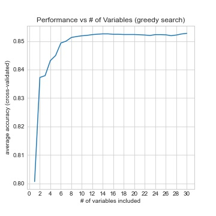
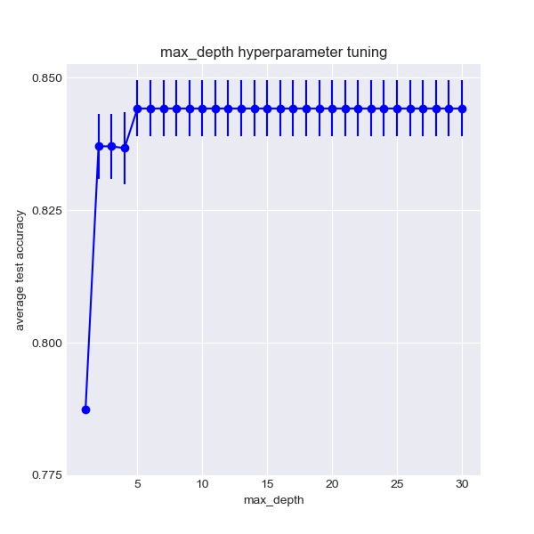

# H1N1 Vaccine Prediction

**Authors**: Christopher Henry
**Date**: 5/13/24

## Overview

Our goal is to predict how likely individuals are to receive their H1N1 vaccine. We will do this using individuals' responses to a survey covering their opinions on illness and vaccines, socioeconomic background, and personal behaviors. For this approach we will apply two different models to the dataset of independent variables: 1) a logistic regression model, and 2) a decision tree model.


## Data Understanding

The dataset for this predictive model comes from responses two the National 2009 H1N1 Flu Survey.

This survey dataset is structured such that each row contains the responses of 1 individual to 35 survey questions, and the survey contains responses from 26,707 individuals. These answers are coded in varying formats: binary (yes/no), ordinal (rating, e.g. 1-5), and categorical (label). Questions cover such topics as: individual's behavior (exposure, use of infection prevention measures, medication), opinions (on infection risk and vaccine effectiveness), and socioeconomic background (sex, race, marital status, education level, housing situation).


## Methods

Approach: We will use the pandas library to organize the dataset and use the scikit-learn library to select and transform features and evaluate predictive and cross-validated model fits to the data. Numerical features were rescaled to have standardized variance; categorical features were one-hot encoded before being rescaled.

Two model classes were fit to the data and compared on performance: a logistic regression model and a decision tree model.

Logistic regression used a greedy approach to identify the next best feature to add and grow the model. This identified that 10-14 features yielded optimal performance. Adding nonlinear terms to the model (via pairwise products) was also explored, as were exploring the parameter space of regularization terms.

Decision tree modeling used an entropy-based approach to identify the variables used in successively growing the tree. Fitting was constrained by targeted exploration of the space of hyperparameters to arrive at the best model.


## Main Results

Key results highlight that:

* A few variables were strong drivers of predictability of H1N1 vaccination status, including: 'doctor_recc_h1n1' (whether a doctor recommended the vaccine), 'opinion_h1n1_risk' (opinions about risk of getting sick without the vaccine), and 'seasonal_vaccine' (whether individuals received the annual flu vaccine)

* Logistic Regression models performed the best with >85% accuracy.
* These models did the best with 10-14 optimally chosen variables. Adding further variables, or including nonlinear products of variables, yielded no further improvement in classification performance.

* Decision tree models performed comparably, though slightly worse, at 84.8% accuracy.
* These models did best when hyperparameters limited the depth of the tree, kept # of features high, and kept min_samples_split and min_samples_leaf small.


* Both models generalized well from the training to the test data, as evidenced by similar ROC curves and F1 scores for both training and test data.


### Example plot showing H1N1 vaccination rate by concern over H1N1

Individuals expressing greater concern over H1N1 risks had higher rates of vaccination.


### A few variables (in isolation) could predict H1N1 vaccination better than a base (Null) model

'doctor_recc_h1n1' and 'opinion_h1n1_risk' were two variables that yielded prediction performance above that of the null model.


### Greedy search identified that using the top 10-14 variables yielded ceiling performance.

There was no further boost in performance by including additional variables in the logistic regression model.


### ROC curves for the Logistic Regression model show good generalization from training to test data.

The optimal regression model yields comparably high scores (area under the ROC curve) on both training and test data, indicating that the model does a good job of predicting the target variable and generalizing across data sets.


### Hyperparameter tuning of Decision Tree finds 20-24 max_features

Cross-validated accuracy was best for larger numbers of features.


### Hyperparameter tuning of Decision Tree finds max_depth >=5

Cross-validated accuracy was best for trees with a depth of 5 or greater.


### Architecture of optimal Decision Tree

Shown is the architecture of the optimal Decision Tree. Early nodes corresponded to key variables ('doctor_recc_h1n1', 'opinion_h1n1_risk')


### ROC curves for the Decision Tree model show good generalization from training to test data.

The optimal decision tree model yields similarly high scores (area under the ROC curve) on both training and test data, indicating that the model does a good job of predicting the target variable and generalizing across data sets. However, overall performance is slightly worse than with using the logistic regression model.


## Conclusions

Both Logistic Regression and Decision Tree models could predict H1N1 vaccination rate at above chance levels using the responses from the H1N1 Survey data.

Performance boosts were driven by a few key variables, but steadily grew with inclusion of the top 10-14 variables. Incorporation of nonlinear products in the regression model yielded negligible improvements.

Hyperparameter tuning and cross-validation approaches identified optimal model parameters for both model classes that had comparable prediction performance (>85% and 84.8% classification accuracy for regression and decision tree models, respectively). These models had good performance, reasonably high F1 scores, and generalized similarly from training to test data, suggesting well-constrained model fits.


## For More Information

Please review our full analysis in [our Jupyter Notebook](./H1N1_vaccine_prediction.ipynb) or our [presentation](./presentation.pdf).

For any additional questions, please contact.

## Repository Structure

Describe the structure of your repository and its contents, for example:

```
├── README.md                           <- The top-level README for reviewers of this project
├── LICENSE.md                          <- License file 
├── H1N1_vaccine_prediction.ipynb       <- Narrative documentation of analysis in Jupyter notebook
├── presentation.pdf                    <- PDF version of project presentation
├── data                                <- Both sourced externally and generated from code
└── images                              <- Both sourced externally and generated from code
```
